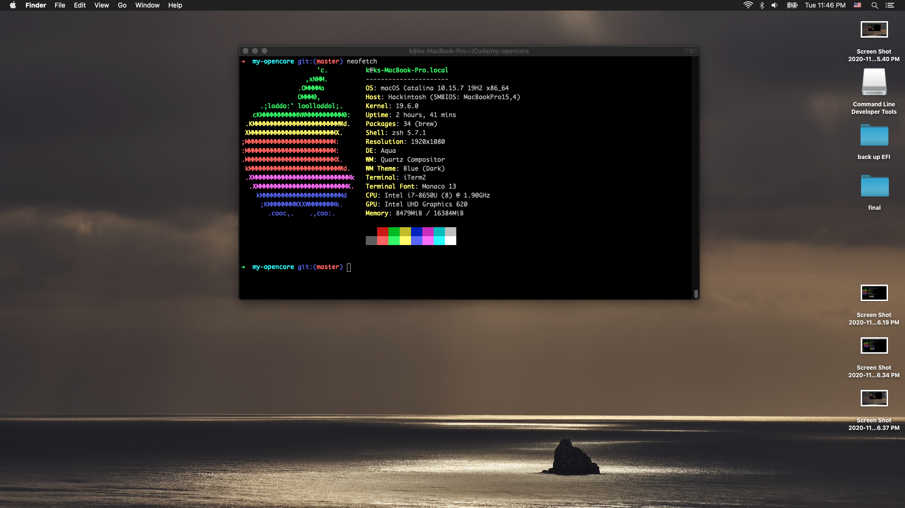

# Opencore for HP EliteBook 840 G5

This EFI is almost based on [hpelitebook850g5-opencore](https://github.com/kecinzer/hpelitebook850g5-opencore) project. Thanks @kecinzer for your hard work!

## Hardware specs
- Name: HP EliteBook 840 G5
- CPU: i7-8650U
- RAM: 16384MiB
- GPU: Intel UHD Graphics 620
- SSD: Samsung PM981 512Gb
- WLAN: Intel 
- Bios ver: 1.10

## Software specs
- OpenCore: 0.6.2
- macOS: Catalina 10.15.7

## Working
- Wifi/bluetooth. Thanks for amazing kext from [OpenIntelWireless](https://github.com/OpenIntelWireless/itlwm)
- Smooth trackpad like real one
- All ports work
- Sleep

## Non-working
- SSD PM981 is not working at all. So i must replace it with the gigabyte one
- iMess, facetime. I don't use them so i've not tried to fix
- Camera, fingerprint

## Quick guide for totally beginner
1. Set up bios in 850g5 link above
2. Just complete [Creating the USB](https://dortania.github.io/OpenCore-Install-Guide/installer-guide/ )
3. Replace EFI folder in USB with EFI folder in this repository
4. Boot into usb -> recovery -> format disk -> install
5. After installation completed. Follow [Post-Install](https://dortania.github.io/OpenCore-Post-Install/)

If have any issues, follow this [debugging steps](https://dortania.github.io/OpenCore-Install-Guide/troubleshooting/debug.html)

Good lucks! :)